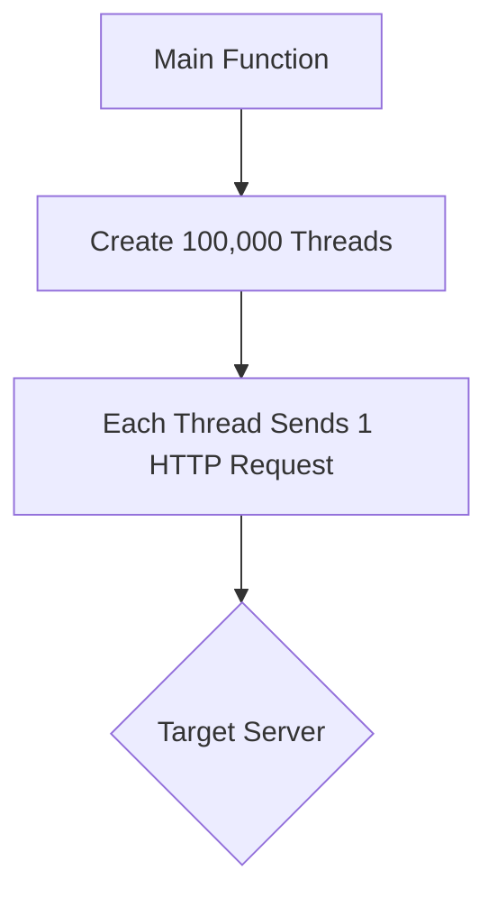

<p align="center">
 
</p>

<p align="center">
  <b>Educational DDoS Simulation Tool for Safe & Ethical Testing</b><br>
  <i>Learn. Simulate. Defend.</i>
</p>

---

## Overview

**DDOS-easy** is a Python-based project designed to demonstrate Distributed Denial-of-Service (DDoS) attack concepts in a safe, ethical, and educational environment. This tool is intended for students, educators, and researchers to explore how basic traffic overloads can affect services — and how to defend against them — using simulated load from thousands of threads.

> Disclaimer:  
> This tool is strictly for educational and authorized research use.  
> Unauthorized use is illegal and unethical. The developers are not responsible for any misuse.

---

## Features

- No external libraries required  
- Thread-based traffic simulation using Python’s standard library  
- Minimal configuration — simple and self-contained  
- Great for testing basic mitigation setups in a local environment  

---

## How It Works

The script launches a large number of threads (`100,000` by default).  
Each thread performs **one HTTP request** to the specified URL using Python’s built-in `urllib`.

---

## Usage

### Prerequisites

- Python 3.x  
- Internet connection  
- Replace `YOUR_INTENDED_WEB_URL` with your actual test server URL (must be owned by you or explicitly authorized)

---

### Running the Script

```bash
python ddos_easy.py
```

Then open `ddos_easy.py` and edit this line:

```python
url = "YOUR_INTENDED_WEB_URL"
```

This is the target address for the simulation.  
Make sure it points to your **own** server or an **authorized test endpoint**.

By default, the script runs `100,000` threads. You can lower that value by editing:

```python
num_threads = 100000
```

Each thread sends one HTTP request and then exits.

---

## File Structure

```txt
DDOS-easy/
│
├── ddos_easy.py    # Main simulation script
└── README.md       # Project documentation
```

---

## Architecture Diagram



This tool does **not** loop or persist traffic — it only fires once per thread.

---

## Extend & Customize

You can easily modify the script to:
- Accept command-line arguments using `argparse`
- Repeatedly send requests within a time window (`duration`)
- Switch to `requests` library for more options
- Use other protocols like UDP, TCP, or WebSockets

---

## Contributing

Pull requests and issue reports are welcome.  
Please make sure all contributions support responsible, ethical use.

---

## Responsible Use Reminder

Do not run this script on public websites or third-party services.

You must:
- Have **written permission** to test the target  
- Use a **controlled test environment** such as a lab or localhost

Misuse of this tool may lead to severe legal consequences.

---

<p align="center">

</p>
